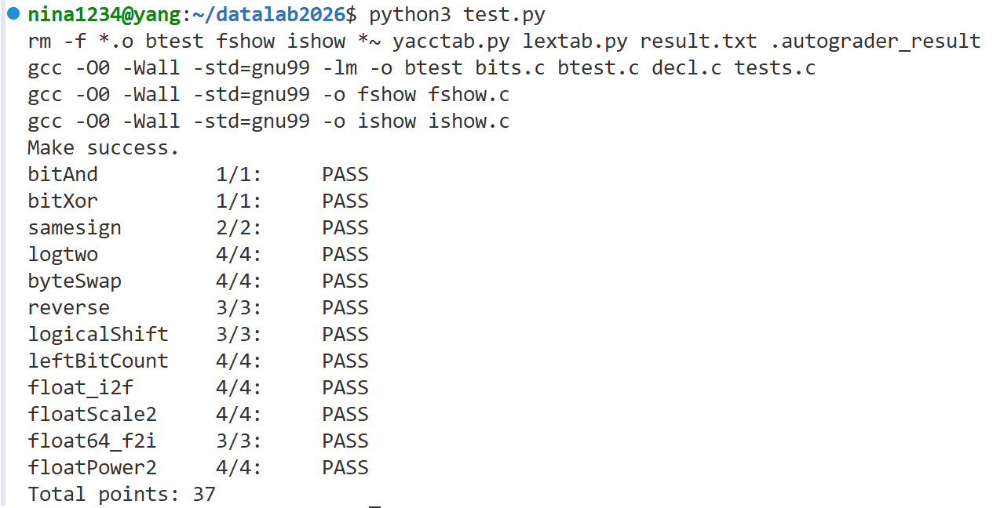

# datalab 报告

姓名：李东阳
学号：2025200699

| 总分 | bitAnd | bitXor | samesign | logtwo | byteSwap | reverse | logicalShift | leftBitCount | float_i2f | floatScale2 | float64_f2i | floatPower2 |
| ---- | ------ | ------ | -------- | ------ | -------- | ------- | ------------ | ------------ | --------- | ----------- | ----------- | ----------- |
| 37   | 1/1    | 1/1    | 2/2      | 4/4    | 4/4      | 3/3     | 3/3          | 4/4          | 4/4       | 4/4         | 3/3         | 4/4         |

test 截图：




## 解题报告

### 亮点

1. float64_f2i
2. float_i2f
3. leftBitCount

### leftBitCount

```c
int y = ~x;
int count = 0;

// 依次检查 y 的高 16/8/4/2/1 位是否全 0
int t = !(y >> 16);
count += t << 4;
y <<= t << 4;

// ... 对 8、4、2 位重复同样的操作

t = !(y >> 31);
count += t;

// 补上 32 位全 1 时漏掉的最后一位
count += !y;
```

题目要求统计一个整数从最高位开始连续 1 的个数。直接数前导 1 不太好写，我把它转成了数前导 0：对 `x` 取反得到 `y = ~x`，这样 `x` 的前导 1 就对应 `y` 的前导 0。

判断「高 n 位是否全 0」可以用 `!(y >> (32 - n))`。因为 `y` 是 `x` 取反的结果，最高位一定是 0，所以 `y` 是非负数，算术右移不会补 1，判断不会出错。

接下来用二分法从高位往低位逐段检查。先看高 16 位是不是全 0：如果是，说明 `x` 的高 16 位全是 1，计数加 16，并把 `y` 左移 16 位，把已经数过的高位丢掉；如果不是，就什么都不做，进入下一轮更小的段。然后依次检查高 8、4、2、1 位，逻辑完全一样。

二分法覆盖的位数一共是 16+8+4+2+1 = 31 位，还差一位。当 `x` 是 `-1`（32 位全 1）时，前面五轮之后 `y` 会变成 0，但计数只到 31。所以最后补一句 `count += !y`：如果 `y` 已经是 0，说明 32 位全是 1，`!y` 为 1，正好补上第 32 位；其他情况下 `y` 不为 0，`!y` 为 0，不影响结果。

### float_i2f

```c
// 特判 0，分离符号位，负数取绝对值
if (x == 0) return 0;
unsigned sign = x & 0x80000000u;
unsigned ux = x;
if (sign) ux = ~ux + 1;

// 二分法求最高位 1 的位置 bits
// ...

// 指数 = bits + 127
unsigned exp = bits + 127;

// 尾数分两种情况
if (bits <= 23) {
    frac = (ux << (23 - bits)) & 0x7FFFFF;
} else {
    // 右移并做向最近偶数舍入
    // ...
}
```

要把一个有符号整数转成 IEEE 754 单精度浮点数的位表示，我分成符号、指数、尾数三部分来做。

符号位直接从 `x` 的最高位取出。如果是负数，需要对 `x` 取反加一得到绝对值。这里有个坑：`INT_MIN` 取反加一之后还是它自己（因为补码表示的范围不对称），所以要用 `unsigned` 来存，防止有符号溢出。

接下来要确定指数。指数和最高位 1 的位置 `bits` 有关，用二分法求出 `bits`：先看 `ux >> 16` 是否非零，是就说明最高位在低 16 位，`bits` 加 16 并把 `ux` 右移 16 位；然后依次对 8、4、2、1 位做同样的判断。这样得到的 `bits` 就是最高位 1 的下标。指数等于 `bits + 127`（加上偏置）。

尾数分两种情况。如果 `bits <= 23`，说明有效位数不超过 23 位，直接把 `ux` 左移 `(23 - bits)` 位，让最高位的 1 对齐到隐含位的位置，再取低 23 位就是尾数。如果 `bits > 23`，说明有效位超过 23 位，需要右移 `(bits - 23)` 位，把多余的低位丢掉，但丢掉的部分不能直接扔，要向最近偶数舍入。

舍入的逻辑是：把移出的低位单独取出来，和「一半」比较。如果大于一半，尾数加 1；如果正好等于一半，就看尾数最低位是不是 1，是 1 才加 1（保证结果是偶数）。舍入之后尾数可能溢出，也就是第 24 位变成 1，这时候要把尾数右移一位、清掉溢出位，同时指数加 1。

最后把符号、指数、尾数按位拼起来返回。

### float64_f2i

```c
// 从 uf2 里分离符号、指数、尾数高 20 位
unsigned sign = (uf2 >> 31) & 1;
unsigned exp = (uf2 >> 20) & 0x7FF;
unsigned frac_hi = uf2 & 0xFFFFF;
unsigned frac_lo = uf1;

// 特判 NaN / Inf（不能用 ==，用减法判断）
if (!(exp - 0x7FF)) return 0x80000000;

// 下溢和上溢
if (exp < 1023) return 0;
if (exp > 1053) return 0x80000000;

// 移位量，分两段拼接尾数
unsigned shift = 1075 - exp;
// ...
```

把一个 64 位 double 转成 32 位 int，并且不允许用 `unsigned long long`、不允许类型转换、也不允许 `==` 和 `^`。所以不能直接开一个 64 位变量来处理，只能把 64 位拆成两个 32 位分段处理。

参数 `uf1` 是低 32 位，`uf2` 是高 32 位。double 的结构是：最高位符号，接着 11 位指数，剩下 52 位尾数。所以 `uf2` 里包含符号、指数和尾数的高 20 位，`uf1` 是尾数的低 32 位。分别用移位和掩码取出 `sign`、`exp`、`frac_hi`、`frac_lo`。

先特判 `exp` 全 1 的情况（NaN 或 Inf），但 `==` 被禁了，所以用 `!(exp - 0x7FF)` 来判断：`exp` 等于 `0x7FF` 时差为 0，取反为 1。然后处理下溢和上溢：`exp < 1023` 说明真实指数小于 0，结果取 0；`exp > 1053` 说明真实指数大于 30，超出 int 范围，返回溢出标志。

接下来算尾数。double 的尾数有 52 位，要右移 `shift = 1075 - exp` 位才能转成整数。因为不能用 64 位变量，就分两种情况：

- 如果 `shift >= 32`，说明要移掉的位数超过 32 位，`frac_lo` 全部被移出，结果只由 `frac_hi` 和隐含的 1 决定。
- 如果 `shift < 32`，`frac_hi` 和 `frac_lo` 都要参与，把 `frac_hi` 左移 `(32 - shift)` 位、`frac_lo` 右移 `shift` 位，再按位或拼起来。

不管哪种情况，都要把隐含的 1 加进去。最后根据符号位决定是否取负。

整段代码没有用到 64 位变量，也没有类型转换，所有比较和判零都用 `!`、`-`、`<`、`>` 实现，满足了题目的限制。
## 收获与感悟

本次实验让我对位运算和 IEEE 754 浮点数表示有了更具体的理解。整数部分的难点主要在于分治与掩码的配合，以及如何用有限的位运算替代条件分支；浮点数部分的难点则在于分类讨论各种边界情况（0、非规格化数、无穷、NaN），以及在不使用 64 位变量和类型转换的前提下完成 64 位到 32 位的转换。在操作符和操作数受限的情况下，需要仔细设计每一步运算，并尽量复用中间结果以满足上限要求。

## 参考的重要资料

- 与同学实现思路（i2f）
- 课程 PPT